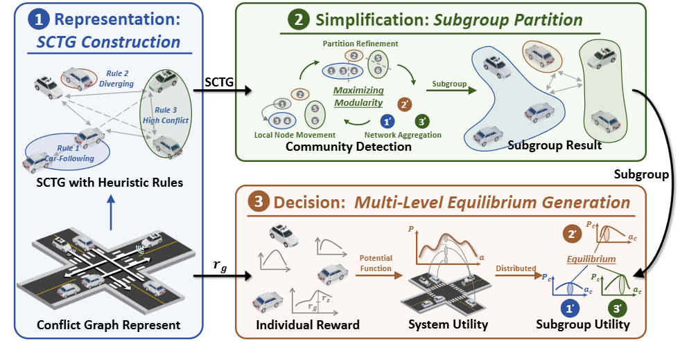
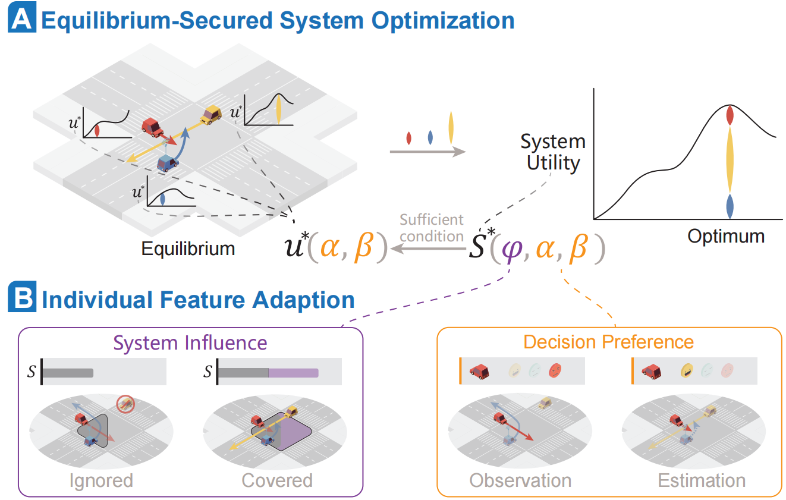
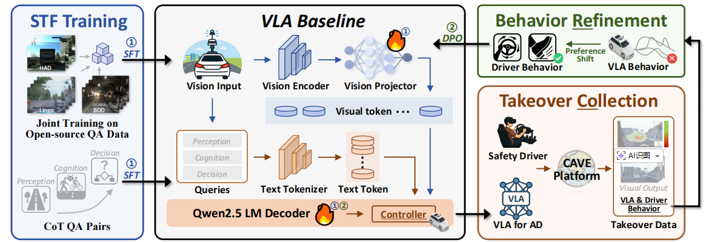
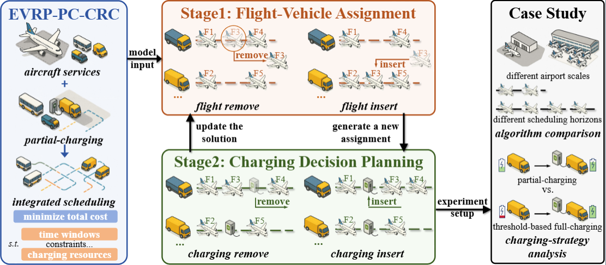
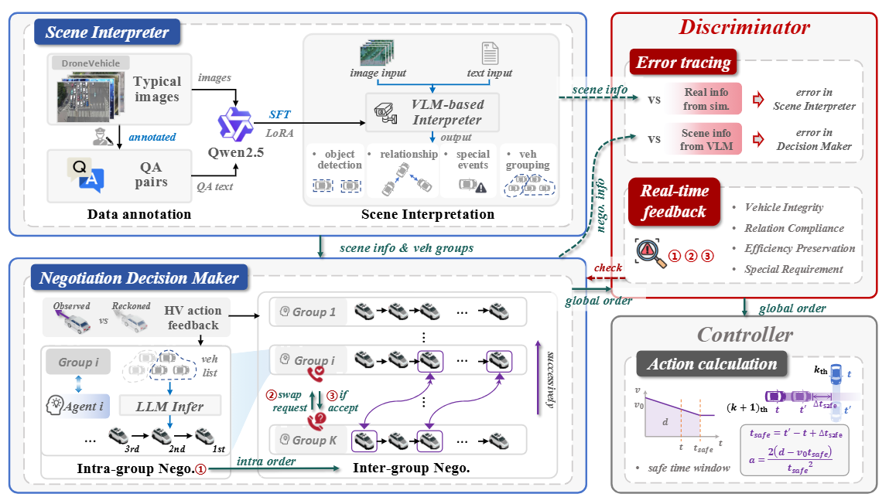

This page shares some of our latest work. Click the publication title to view the article. We sincerely welcome your comments.

## Multi-Vehicle Cooperative Decision

  
<a href="https://papers.ssrn.com/sol3/papers.cfm?abstract_id=6297834">Game in Graph: Distributed Cooperative Decision-Making Framework for Multi-Level Equilibrium in Mixed Traffic.</a>

  

    

    

      
<strong><em>Shiyu Fang</em></strong>, Bing Zhu, Peng Hang, Chen Lv, Jian Sun*.

      
<strong>Abstract:</strong> This paper proposes the Game in Graph (GIG) framework for cooperative decision-making. Traffic scenarios are modeled as a Spatiotemporal Conflict Topological Graph (SCTG) with heuristic-refined edges. The global graph is partitioned into high-conflict subgraphs via modularity maximization to enable distributed optimization. A bottom-up system utility is then decomposed across subgraphs, achieving multi-level equilibrium among vehicles, subgroups, and the overall system. 

    

  

  
Toward Cooperative Driving in Mixed Traffic: An Adaptive Potential Game-Based Approach with Field Test Verification.

  

    

    

      
<strong><em>Shiyu Fang</em></strong>, Xiaocong Zhao, Xuekai Liu, Peng Hang*, Jianqiang Wang, Yunpeng Wang, Jian Sun*.

      
<strong>Abstract:</strong> This paper proposes an adaptive potential game (APG)–based cooperative driving framework. A system utility function is constructed from a general individual utility form to jointly optimize individual and system objectives. The Lloyd Shapley value is adopted to quantify each vehicle’s marginal contribution. Moreover, HDV preference estimation is iteratively refined by comparing observed behaviors with APG-predicted actions, enhancing overall safety and efficiency. 

    

  

## Single-Vehicle Interactive Decision

  
<a href="https://www.researchgate.net/publication/395709363_CoReVLA_A_Dual-Stage_End-to-End_Autonomous_Driving_Framework_for_Long-Tail_Scenarios_via_Collect-and-Refine">CoReVLA: A Dual-Stage End-to-End Autonomous Driving Framework for Long-Tail Scenarios via Collect-and-Refine.</a>

  

    

    

      
<strong><em>Shiyu Fang</em></strong>, Yiming Cui, Haoyang Liang, Chen Lv, Peng Hang*, Jian Sun.

      
<strong>Abstract:</strong> CoReVLA is a continual end-to-end driving framework targeting long-tail scenarios. It is first fine-tuned on mixed driving QA datasets, then deployed in the Transportation Cave Automatic Virtual Environment (TransCAVE) to collect driver takeover data as failure signals. Finally, Direct Preference Optimization (DPO) refines the model using human preferences, avoiding reward hacking.

    

  

## Intelligent Transportation Systems

  
<a href="https://papers.ssrn.com/sol3/papers.cfm?abstract_id=6418431">Integrated service and partial-charging scheduling for electric ground-handling vehicles in airports: A two-stage adaptive large neighborhood search approach.</a>

  

    

    

      
Tan Liu, Peng Hang, Yiming Cui, <strong><em>Shiyu Fang*</em></strong>, Guoyang Qin, Jian Sun.

      
<strong>Abstract:</strong> This paper addresses the integrated scheduling of aircraft services and electric ground handling vehicles (EGHVs) under charging constraints by developing a mixed-integer program (MIP) model and a two-stage adaptive large neighborhood search (ALNS) algorithm. By decomposing the problem into service assignment and partial-charging decision stages, the proposed heuristic efficiently explores the solution space, significantly outperforming Gurobi and benchmark algorithms in experiments based on Shanghai Hongqiao International Airport data. 

    

  

  
<a href="https://papers.ssrn.com/sol3/papers.cfm?abstract_id=6451841">V2I-LENC: A Vehicle-Infrastructure Language-Enhanced Negotiation and Cooperation Chain for Mixed-Traffic.</a>

  

    

    

      
Yiming Cui, <strong><em>Shiyu Fang*</em></strong>, Geyuan Zhang, Haotian Shi, Peng Hang, Hao Zhang, Jian Sun.

      
<strong>Abstract:</strong> This paper proposes V2I-LENC, a language-enhanced negotiation chain designed to improve autonomous driving in complex conflict zones. By leveraging a fine-tuned VLM for semantic scene understanding and an LLM-based hierarchical negotiation module, the framework balances global coordination with individual vehicle demands. A unique discriminator module ensures logical consistency before a low-level controller translates decisions into actions. Experiments in CARLA demonstrate that V2I-LENC significantly outperforms baselines in safety, efficiency, and demand satisfaction across varying traffic scales. 

    

  

