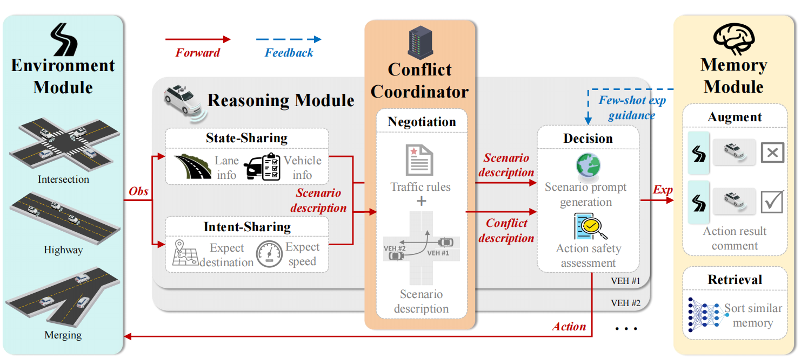
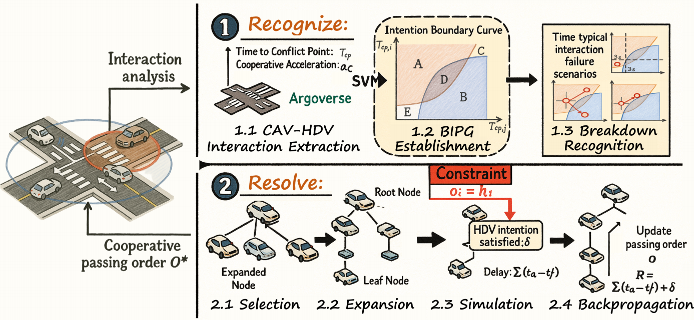
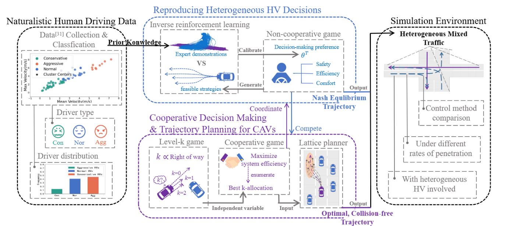
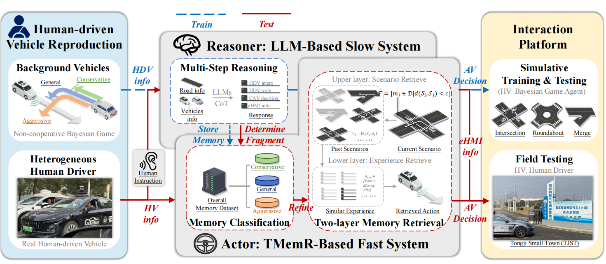
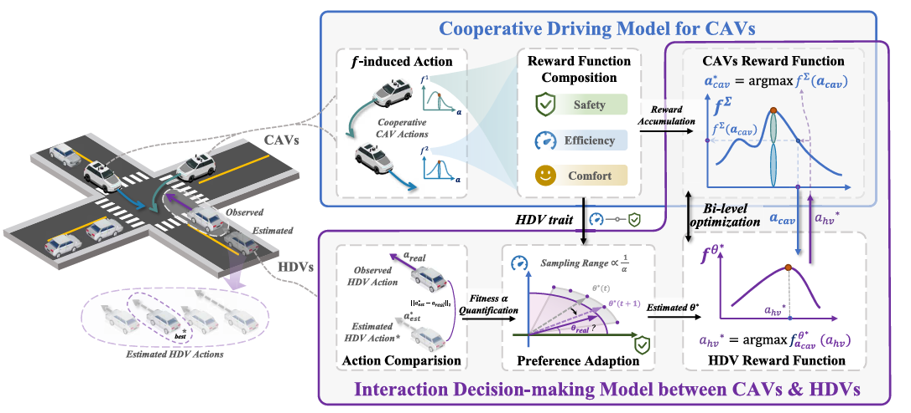

My research focuses on multi-vehicle cooperative decision, and single-vehicle interactive decision. This page lists a selection of my publications. For a complete list, please see my [Google Scholar](https://scholar.google.com.hk/citations?user=3I6vwmoAAAAJ&hl=zh-CN) profile. Click the publication title to view the article.

## Multi-Vehicle Cooperative Decision
Autonomous vehicles still face frequent challenges during open-road trials. Connected vehicle technology offers a promising alternative pathway to enhance autonomous driving decision-making in complex mixed-traffic scenarios. To this end, our research aims to improve the safety and efficiency of autonomous vehicles in high-density traffic through multi-vehicle cooperative decision-making.

  
<a href="https://ieeexplore.ieee.org/document/10933798">Towards Interactive and Learnable Cooperative Driving Automation: a Large Language Model-Driven Decision-Making Framework.</a>

  

    

    

      
<strong><em>Shiyu Fang</em></strong>, Jiaqi Liu, Mingyu Ding, Yiming Cui, Chen Lv, Peng Hang, Jian Sun*. <strong><em>IEEE Transactions on Vehicular Technology</em></strong>, 2025.

      
<em>TL;DR: A centralized-distributed multi-vehicle cooperative framework built upon LLMs.</em>

    

  

  
<a href="https://ieeexplore.ieee.org/document/11097650">Recognize Then Resolve: A Hybrid Framework for Understanding Interaction and Cooperative Conflict Resolution in Mixed Traffic.</a>

  

    

    

      
<strong><em>Shiyu Fang</em></strong>, Donghao Zhou, Yiming Cui, ChengKai Xu, Peng Hang, Jian Sun. <strong><em>2025 IEEE Intelligent Vehicles Symposium (IV)</em></strong>, Cluj-Napoca, Romania, 2025.

      
<em>TL;DR: Recognize the interaction evolution trend before cooperatively resolving conflicts.</em>

    

  

  
<a href="https://ieeexplore.ieee.org/document/10529605">Cooperative Driving of Connected Autonomous Vehicles in Heterogeneous Mixed Traffic: A Game Theoretic Approach.</a>

  

    

    

      
<strong><em>Shiyu Fang</em></strong>, Peng Hang*, Chongfeng Wei, Yang Xing, Jian Sun. <strong><em>IEEE Transactions on Intelligent Vehicles</em></strong>, 2024.

      
<em>TL;DR: Integrate cooperative–Level-k games and IRL HV modeling for heterogeneous mixed-traffic cooperation.</em>

    

  

## Single-Vehicle Interactive Decision
Autonomous Vehicles have entered the stage of commercialization, yet their performance in interactive scenarios remains unsatisfactory due to challenges such as decision interpretability, human driver heterogeneity, and scenario diversity. To this end, we aim to improve the ability of autonomous vehicles to understand the intentions of surrounding agents, as well as to enhance the interpretability of their own behavior to others.

  
<a href="https://ieeexplore.ieee.org/document/11264499">Interact, Instruct to Improve: A LLM-Driven Parallel Actor-Reasoner Framework for Enhancing Autonomous Vehicle Interactions.</a>

  

    

    

      
<strong><em>Shiyu Fang</em></strong>, Jiaqi Liu, Chengkai Xu, Chen Lv, Peng Hang*, Jian Sun. <strong><em>IEEE Transactions on Intelligent Transportation Systems</em></strong>, 2025.

      
<em>TL;DR: Enable real-time AV-HV interaction via LLM across multiple scenarios with real vehicle.</em>

    

  

  
<a href="https://ieeexplore.ieee.org/abstract/document/11227114">A Game-Theoretic Framework of Interaction and Cooperative Driving for CAVs at Mixed Unsignalized Intersections.</a>

  

    

    

      
Shiyu Fang, Yiming Cui, <strong><em>Shiyu Fang</em></strong>, Qian Chen, Yafei Wang and Jian Sun <strong><em>IEEE Transactions  INTERNET OF THINGS JOURNAL</em></strong>, 2025.

      
<em>TL;DR: Enable cooperative CAV–HDV interaction via twin-game adaptation, improving mixed-traffic safety and efficiency at unsignalized intersections.</em>

    

  

